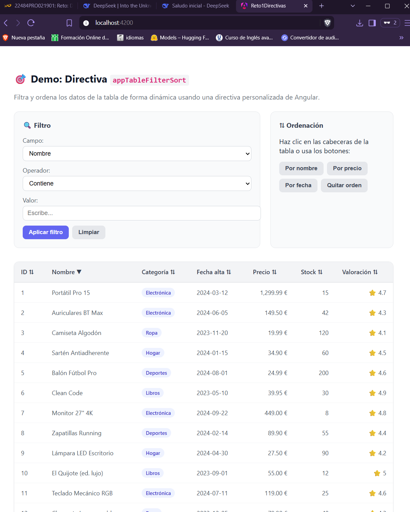
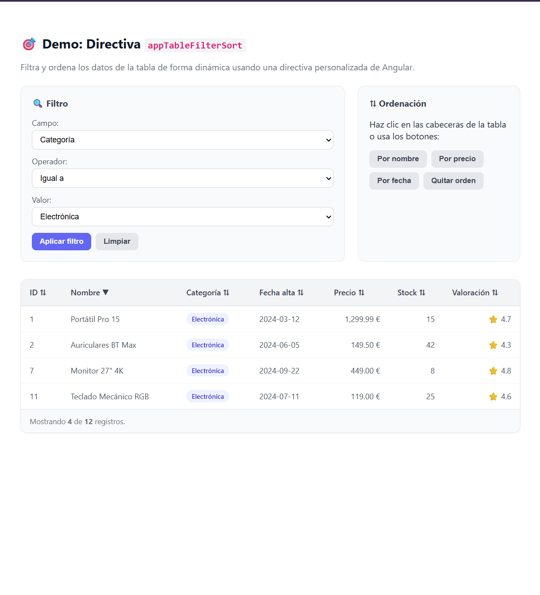
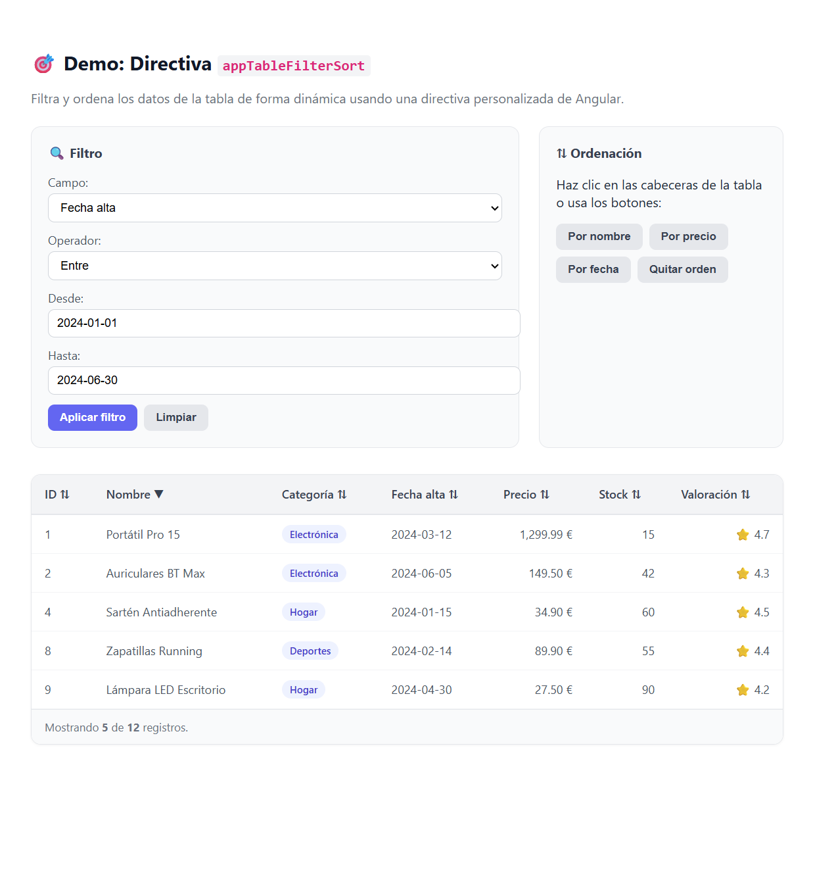
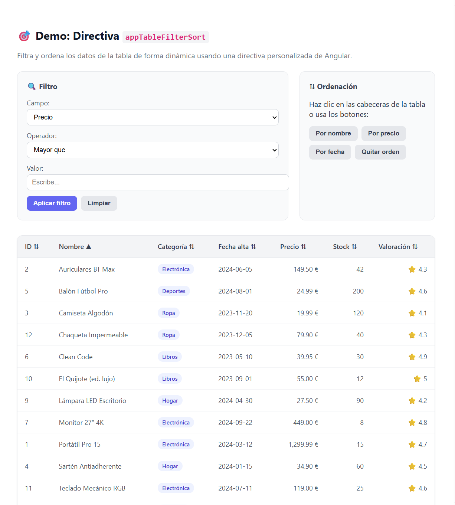
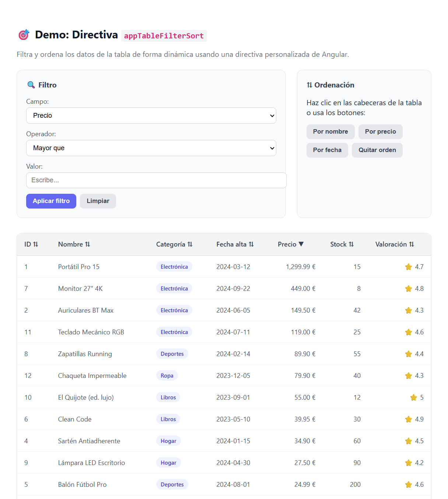
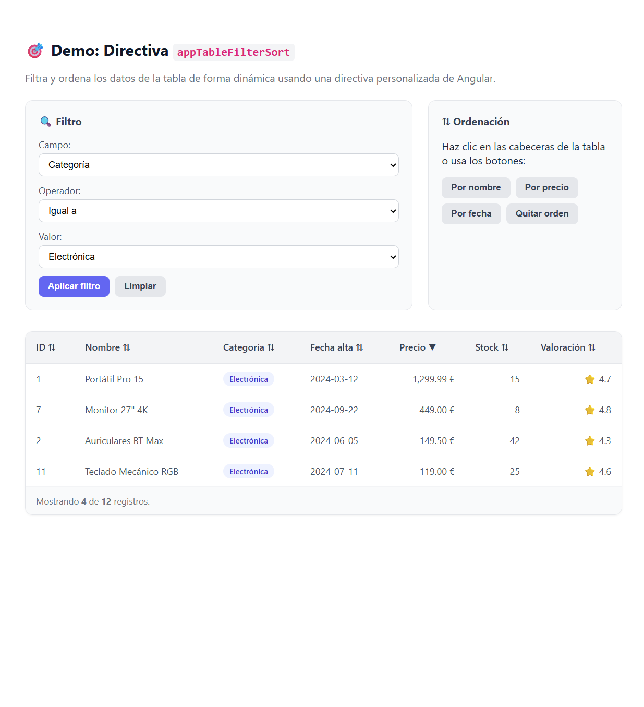
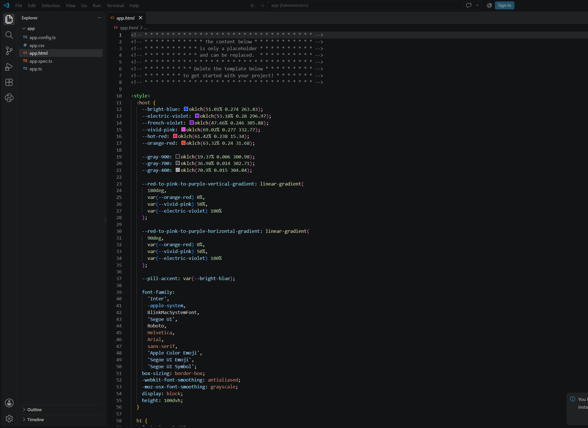
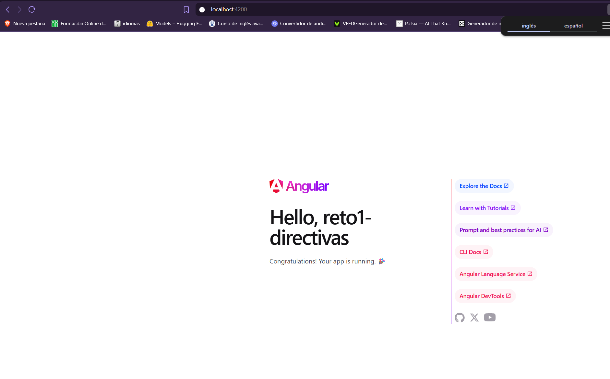
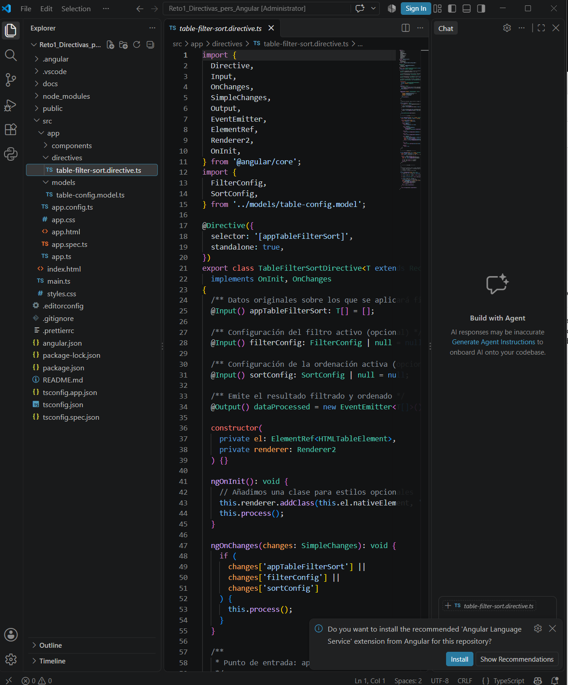
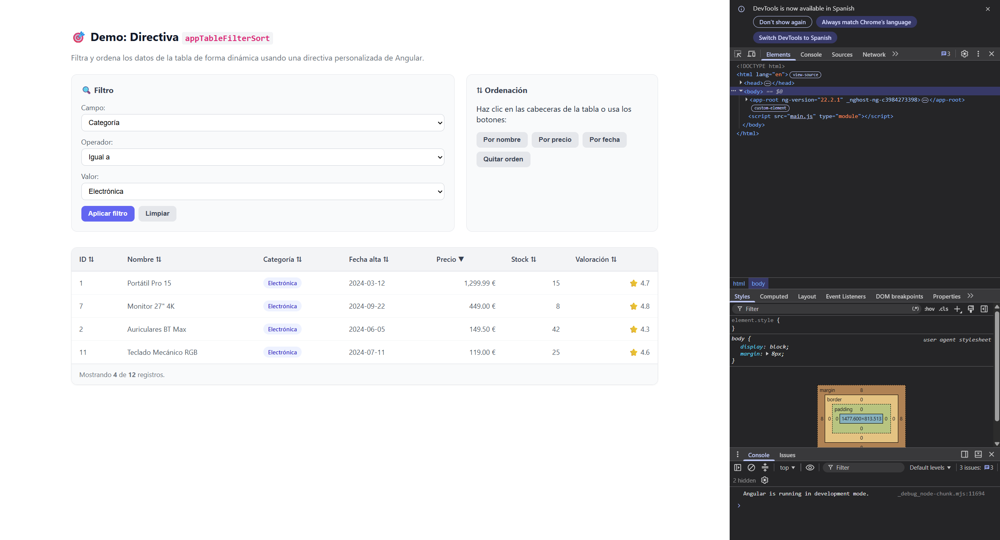

# 🥷 Reto 1 — Directivas Personalizadas en Angular

> Directiva personalizada `appTableFilterSort` que añade capacidades dinámicas de **filtrado** y **ordenación** a cualquier tabla HTML en una aplicación Angular.


---

## 📸 Vista previa



Demo interactiva con tabla de productos, panel de filtros y controles de ordenación.

---

## 🎯 ¿Qué es esta directiva?

`appTableFilterSort` es una **directiva de atributo** que se aplica a cualquier elemento `<table>` y le dota de dos capacidades:

1. **Filtrado dinámico** de filas basado en criterios configurables:
   - Coincidencia exacta (`equals`)
   - Contiene texto (`contains`)
   - Comparaciones numéricas o de fecha (`gt`, `lt`)
   - Rangos (`between`)
   - Pertenencia a una lista (`in`)

2. **Ordenación dinámica** por cualquier campo del modelo, en dirección `asc` o `desc`.

La directiva **no manipula el DOM directamente**: recibe los datos por `@Input`, los procesa y emite el resultado por `@Output`, dejando que el componente decida cómo renderizarlo. Esto la hace reutilizable, testeable y compatible con `OnPush` y signals.

---

## ✨ Características

- ✅ **Standalone directive** (Angular 17+, sin necesidad de módulos)
- ✅ **Genérica** con `<T extends Record<string, any>>`
- ✅ **Soporta múltiples operadores de filtrado**
- ✅ **Detección automática de fechas ISO** para comparaciones temporales
- ✅ **Detección automática de números** para comparaciones numéricas
- ✅ **Emite resultado filtrado y ordenado por `@Output`**
- ✅ **Sin dependencias externas** (solo Angular core)
- ✅ **Testeable** con `TestBed`

---

## 🚀 Instalación y uso

### 1. Copia los archivos necesarios

```
src/app/
├── directives/
│   └── table-filter-sort.directive.ts
└── models/
    └── table-config.model.ts
```

### 2. Importa la directiva en tu componente

```typescript
import { Component } from '@angular/core';
import { CommonModule } from '@angular/common';
import { TableFilterSortDirective } from './directives/table-filter-sort.directive';

@Component({
  selector: 'app-mi-tabla',
  standalone: true,
  imports: [CommonModule, TableFilterSortDirective],
  templateUrl: './mi-tabla.html',
})
export class MiTabla {
  datos = [/* ...tus datos... */];
  filtro = { field: 'nombre', operator: 'contains', value: 'pro' };
  orden  = { field: 'precio', direction: 'desc' };

  onDataProcessed(data: any[]) {
    console.log('Datos filtrados y ordenados:', data);
  }
}
```

### 3. Aplica la directiva en la tabla

```html
<table
  [appTableFilterSort]="datos"
  [filterConfig]="filtro"
  [sortConfig]="orden"
  (dataProcessed)="onDataProcessed($event)"
>
  <thead>
    <tr>
      <th>Nombre</th>
      <th>Categoría</th>
      <th>Precio</th>
    </tr>
  </thead>
  <tbody>
    @for (item of datosProcesados; track item.id) {
      <tr>
        <td>{{ item.nombre }}</td>
        <td>{{ item.categoria }}</td>
        <td>{{ item.precio }} €</td>
      </tr>
    }
  </tbody>
</table>
```

---

## 📚 API de la directiva

### Selector

```
[appTableFilterSort]
```

### Inputs

| Input | Tipo | Descripción |
|---|---|---|
| `appTableFilterSort` | `T[]` | **Obligatorio.** Array de datos originales. |
| `filterConfig` | `FilterConfig \| null` | Configuración del filtro a aplicar. |
| `sortConfig` | `SortConfig \| null` | Configuración de la ordenación. |

### Output

| Output | Tipo | Descripción |
|---|---|---|
| `dataProcessed` | `EventEmitter<T[]>` | Emite el array filtrado + ordenado. |

### Tipos auxiliares

```typescript
export type FilterOperator =
  | 'equals'    // Igual a
  | 'contains'  // Contiene texto
  | 'gt'        // Mayor que
  | 'lt'        // Menor que
  | 'between'   // Entre dos valores
  | 'in';       // Pertenece a una lista

export type SortDirection = 'asc' | 'desc' | null;

export interface FilterConfig {
  field: string;
  operator: FilterOperator;
  value: any | [any, any];
}

export interface SortConfig {
  field: string;
  direction: SortDirection;
}
```

---

## 🔍 Ejemplos de filtrado

### Filtrar por categoría (coincidencia exacta)

```typescript
const filtro: FilterConfig = {
  field: 'categoria',
  operator: 'equals',
  value: 'Electrónica',
};
```



### Filtrar por rango de fechas

```typescript
const filtro: FilterConfig = {
  field: 'fechaAlta',
  operator: 'between',
  value: ['2024-01-01', '2024-06-30'],
};
```



### Filtrar por precio mayor que

```typescript
const filtro: FilterConfig = {
  field: 'precio',
  operator: 'gt',
  value: 100,
};
```


---

## ⇅ Ejemplos de ordenación

### Ordenar por nombre ascendente

```typescript
const orden: SortConfig = { field: 'nombre', direction: 'asc' };
```



### Ordenar por precio descendente

```typescript
const orden: SortConfig = { field: 'precio', direction: 'desc' };
```



### Filtro + ordenación simultáneos

```typescript
filtro = { field: 'categoria', operator: 'equals', value: 'Electrónica' };
orden  = { field: 'precio', direction: 'desc' };
```



---

## 🏗️ Estructura del proyecto



```
Reto1_Directivas_pers_Angular/
├── docs/
│   └── capturas/
│       ├── 01-setup/
│       ├── 02-directiva/
│       ├── 03-demo/
│       ├── 04-documentacion/
│       └── 05-cierre/
├── src/
│   ├── app/
│   │   ├── components/
│   │   │   └── demo-table/
│   │   ├── data/
│   │   │   └── mock-products.ts
│   │   ├── directives/
│   │   │   └── table-filter-sort.directive.ts
│   │   ├── models/
│   │   │   ├── product.model.ts
│   │   │   └── table-config.model.ts
│   │   ├── app.ts
│   │   └── app.html
│   ├── index.html
│   ├── main.ts
│   └── styles.css
├── README.md
├── angular.json
├── package.json
└── tsconfig.json
```

---

## 📸 Galería de capturas

### Fase 1 — Setup



### Fase 2 — Directiva



### Fase 3 — Demo funcional

| Estado | Captura |
|---|---|
| Sin filtros |  |
| Consola limpia |  |

---

## 🧪 Testing

La directiva incluye un archivo `.spec.ts` con tests básicos. Para ejecutarlos:

```bash
npm test
```

Los tests cubren:
- Instanciación de la directiva
- Filtrado por cada operador
- Ordenación ascendente y descendente
- Combinación filtro + orden

---

## 🛠️ Tecnologías usadas

| Tecnología | Versión |
|---|---|
| Angular | 22.x |
| TypeScript | 5.x |
| Node.js | 22.x |
| CSS | Puro (sin frameworks) |

---

## 📝 Sobre el reto

Este proyecto forma parte del **Reto 1 — Frame 5 (U2.1)** del curso *Desarrollo Web con Frameworks*.

**Objetivo:** demostrar el dominio de **directivas personalizadas** en Angular, aplicadas a un caso real (tablas de datos con filtrado y ordenación).

**Entregables cubiertos:**
- ✅ Código fuente en repositorio GitHub
- ✅ Demostración funcional en la app
- ✅ Documentación en este README

---

## 📄 Licencia

MIT — libre para usar, modificar y compartir.